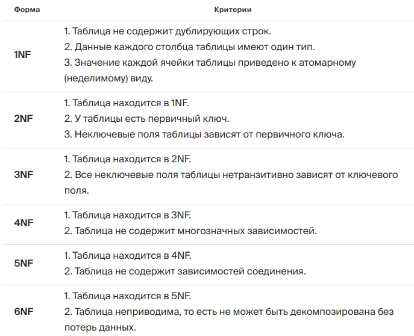
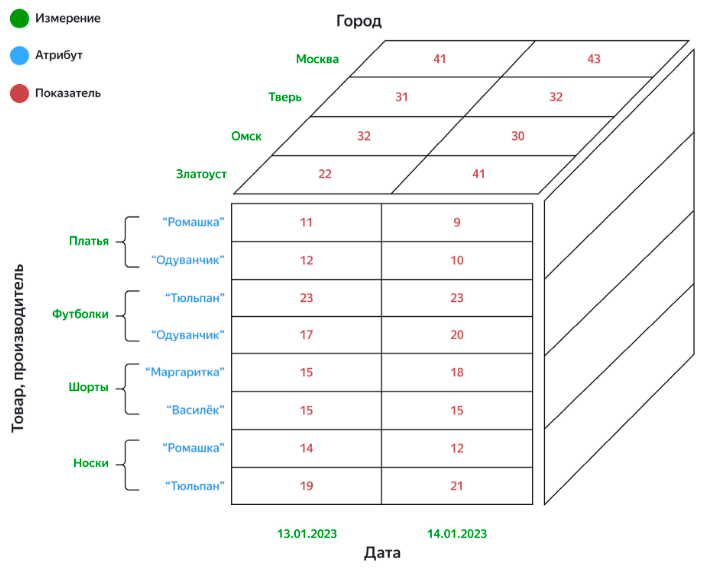
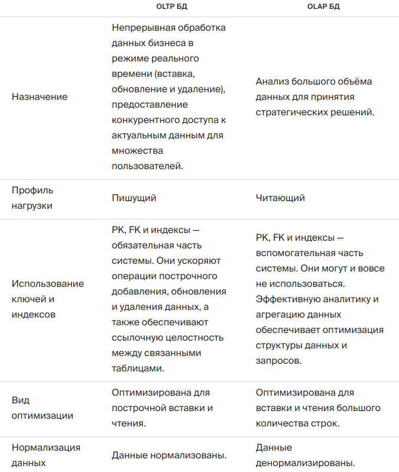

https://lab.karpov.courses/learning/355/module/3434/lesson/30431/85545/401081/

## Нормальные формы
- Нестеров С.А. – Базы данных, 2016 – Глава 5 – Нормализация реляционных баз данных.
- Данные зависят от ключа [1НФ], всего ключа [2НФ] и ничего, кроме ключа [3НФ].
- [Практика нормализации БД](https://lab.karpov.courses/learning/355/module/33434/lesson/30431/85547/401094/)
- 
### 1NF
Таблица source1.craft_market_wide ждёт не дождётся, когда она наконец станет соответствовать критериям первой нормальной формы. Напомним их:
- в таблице нет дублирующих строк;
- данные каждого столбца таблицы приведены к одному типу;
- атрибуты таблицы приведены к атомарному виду (то есть их нельзя поделить на более мелкие составные значения).

### 2NF
Чтобы перевести модель данных в 2NF, должны выполняться следующие критерии:
- модель данных находится в 1NF;
- у всех таблиц модели есть первичный ключ;
- неключевые поля таблиц зависят от первичного ключа.
- нет полей, которые зависят от части первичного ключа

### Аномалии
| ID_Преподавателя | ФИО      | ID_Категории | Тип         | ID_Курса | Курс      | ID_Лекции |
|------------------|----------|--------------|-------------|----------|-----------|-----------|
| 1                | Иванов   | 1            | Full Staff  | 1        | Hard ML   | 1         |
| 1                | Иванов   | 1            | Full Staff  | 2        | Аналитика | 1         |
| 2                | Петров   | 1            | Full Staff  | 1        | Hard ML   | 2         |
| 3                | Сидоров  | 2            | Part Staff  | 1        | Hard ML   | 3         |
| 3                | Сидоров  | 2            | Part Staff  | 2        | Аналитика | 2         |

**Аномалия вставки.** В отношение нельзя вставить данные о преподавателе, который пока не участвует ни в одном блоке.
**Аномалия удаления**. Если по курсу временно прекращены лекции, то при удалении данных о лекции по этому курсу будут удалены и данные о самом курсе. При этом, если был преподаватель, который работал только над этим курсом, то будут потеряны и данные об этом сотруднике.
**Аномалия обновления**. Если необходимо изменить какую-либо информацию о преподавателе, то придётся изменять значения атрибутов во всех записях.

Отношение находится во второй нормальной форме тогда и только тогда, когда оно находится в первой нормальной форме и каждый его неключевой атрибут неприводимо зависим от первичного ключа.

**Неприводимость** означает, что в составе потенциального ключа отсутствует меньшее подмножество атрибутов, от которого можно также вывести данную функциональную зависимость. Для неприводимой функциональной зависимости часто используется эквивалентное понятие «полная функциональная зависимость».

Перефразируя, отношение находится во второй нормальной форме тогда и только тогда, когда оно находится в первой нормальной форме и нет неключевых атрибутов, зависящих от части сложного ключа.

```sql
CREATE TABLE nf_lesson.preparatory_2_1nf AS
SELECT id, -- идентификатор записи 
        (regexp_split_to_array(craftsman_name, '\s+'))[1] craftsman_name,
        (regexp_split_to_array(craftsman_name, '\s+'))[2] craftsman_surname,
        craftsman_address,
        (regexp_split_to_array(customer_name, '\s+'))[1] customer_name,
        (regexp_split_to_array(customer_name, '\s+'))[2]  customer_surname,
        customer_address
FROM nf_lesson.preparatory_1_1nf;
```

```sql
CREATE TABLE nf_lesson.preparatory_3_1nf AS
SELECT id, -- идентификатор записи
        craftsman_name,
        craftsman_surname,
        (regexp_match(craftsman_address, '\d+'))[1] craftsman_address_building,
        (regexp_match(craftsman_address, '[a-zA-Z]+[a-zA-Z\s]+'))[1] craftsman_address_street,
        customer_name,
        customer_surname,
        (regexp_match(customer_address, '\d+'))[1] customer_address_building,
        (regexp_match(customer_address, '[a-zA-Z]+[a-zA-Z\s]+'))[1] customer_address_street
FROM nf_lesson.preparatory_2_1nf;
```

```sql
SELECT regexp_matches('foobarbequebazilbarfbonk', 'b[^u]+');

select array_to_string((regexp_split_to_array('323 Мамина сибиряка привет', '\s+'))[2:], ' ');
```

### 6NF
Переменная отношения находится в 6НФ тогда и только тогда, когда она удовлетворяет всем нетривиальным зависимостям соединения. Из определения следует, что переменная находится в 6НФ тогда и только тогда, когда она неприводима, то есть не может быть подвергнута дальнейшей декомпозиции без потерь.
- [6НФ - Конспект: теория](https://lab.karpov.courses/learning/29/module/392/lesson/3073/9356/37076/)

### Таблица признаков нормальных форм



Показатель, разложенный по измерениям и атрибутам, называется фактом.



#### Сравнительная таблица характеристик «звезды» и «снежинки»:

