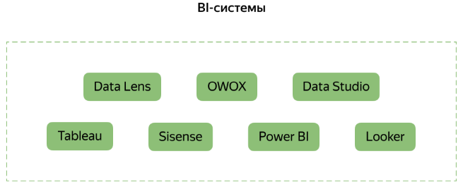
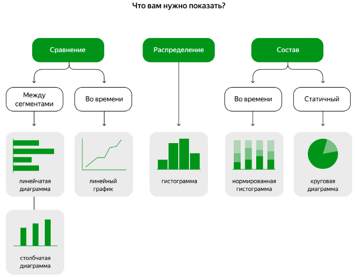

### Pipeline

- обработка данных
  - Apache Airflow
  - NiFi
  - Oozie
  - Luigi
  - cron
  - Apache Spark, Spark Streaming
  - Apache Storm
  - Flink
- основные виды хранилищ:
  - SQL базы данных — MySQL, PostgreSQL и пр. — используют, если объёмы данных небольшие, в них есть чёткая структура и их можно представить в виде таблиц.
  - NoSQL базы данных — MongoDB, Apache Cassandra, ScyllaDB, ClickHouse и пр. — используют, если в данных нет чёткой структуры и они разнородны. Такими данными могут быть веб-документы.
  - Распределённые хранилища — например, HDFS, Greenplum — используют, если данных много и их нужно обрабатывать распределённо в кластере.
  - Брокеры сообщений — Kafka, RabbitMQ и пр. — используют для стриминга. Например, данные по местонахождению автобусов нужно обновлять в реальном времени как только они поступают в хранилище — геопозиция транспорта постоянно меняется.
  - Облачные хранилища — например, Amazon S3 — используют, если компания решила хранить и обрабатывать данные в облаке. Тогда инфраструктуру для этого предоставляет компания-провайдер.
-  Бизнес-аналитики визуализируют статистику в Power BI, Tableau, Metabase. На подготовленных данных могут обучать модели ML, используя Python-библиотеку scikit-learn, Spark ML, Amazon ML.

### Параметры подключения к БД
```json
{
  "student_db_connection": {
    "host": "rc1b-ljuhemk3tzvzv3e2.mdb.yandexcloud.net",
    "port": 6432,
    "dbname": "playground_sp0_20231015_66c4a31b55",
    "user": "de_sp0_20231015_66c4a31b55",
    "password": "bdeda01d75bc44458cd71154646e5477"
  }
}

База данных создана. Ваш секретный ключ: 2d7342e3b96c6119377fec61
```

### Анализ связей в БД
```postgresql
SELECT c.table_schema,
             c.table_name,
             c.column_name,
             pgd.description
FROM pg_catalog.pg_statio_all_tables AS st
INNER JOIN pg_catalog.pg_description pgd ON (pgd.objoid=st.relid)
INNER JOIN information_schema.columns c ON (
		pgd.objsubid=c.ordinal_position
	AND c.table_schema=st.schemaname 
	AND c.table_name=st.relname);

select * from pg_catalog.pg_statio_all_tables;
select * from pg_catalog.pg_description;
select * from information_schema.columns;

-- 
SELECT
	tc.table_name,
	kcu.column_name,
	ccu.table_name AS foreign_table_name,
	ccu.column_name AS foreign_column_name
FROM information_schema.table_constraints AS tc
JOIN information_schema.key_column_usage AS kcu 
	ON tc.constraint_name = kcu.constraint_name 
	AND tc.table_schema = kcu.table_schema
JOIN information_schema.constraint_column_usage AS ccu
	ON ccu.constraint_name = tc.constraint_name
	AND ccu.table_schema = tc.table_schema
WHERE tc.constraint_type = 'FOREIGN KEY';

select * from information_schema.table_constraints;
select * from information_schema.key_column_usage;
select * from information_schema.constraint_column_usage;
```

### BI системы


### План действий
1. Спланировать какие данные нужны для дашбордов. Их будет 4
2. проверить их качество
3. написать запросы. Предполагаем, что будем делать view

### Представления - view
```textmate
Представление — это именованный запрос, выполняемый каждый раз, 
когда к нему обращаются.

Чтобы создать представление, используйте команду CREATE VIEW ... AS. 
Если ошибётесь в представлении, удалите его с помощью команды DROP VIEW IF EXISTS и создайте новое. 
Или в одной команде CREATE OR REPLACE VIEW ... AS удалите старое и создайте новое.

Материализованное представление — это именованный запрос, результаты которого сохраняются, 
а запрос выполняется заново только тогда, когда нужно.

Чтобы создать материализованное представление, используйте команду CREATE MATERIALIZED VIEW ... AS; 
чтобы обновить — REFRESH MATERIALIZED VIEW ; 
чтобы удалить — DROP MATERIALIZED VIEW IF EXISTS.
```

### Типы диаграмм


Доступ к таблице в облаке:
Используйте префикс ecomm_marketing перед названием таблицы, к данным которой хотите получить доступ. Пример обращения к таблице:  ecomm_marketing.table_name.

### Пример обновления столбцов
```sql
update "002_DM_clients" as t
set age = s.age
from "002_BUFF_clients" as s
where t.client_id = s.client_id;
```