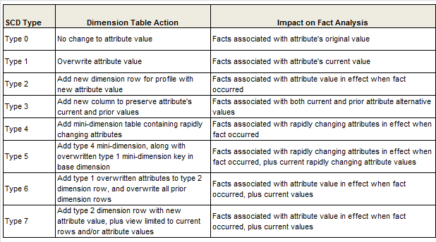
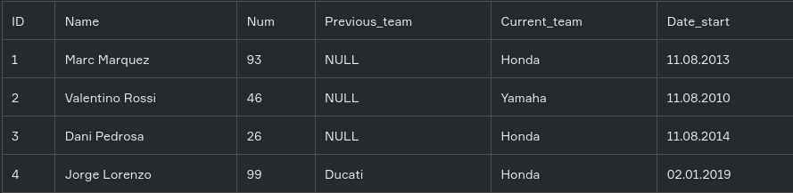
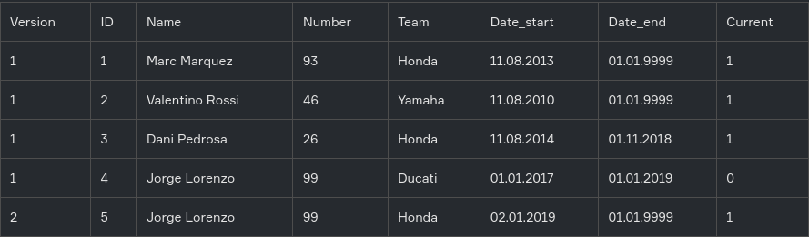

https://lab.karpov.courses/learning/29/module/392/lesson/3074/9361/37101/

**Медленно меняющимися измерениями** (Slowly Changing Dimensions) называются таблицы измерений, в которых некоторые атрибуты могут изменить свои значения по истечении некоторого периода времени, причем частота таких изменений является небольшой.

Всего существует 8 основных типов SCD, которые определяют, как история изменений может быть отражена в модели.

### SCD 0
SCD 0 — заключается в том, что данные после первого попадания в таблицу далее никогда не изменяются. Этот метод практически никем не используется, т.к. он не поддерживает версионности. Он нужен лишь как нулевая точка отсчета для методологии SCD. По сути, вообще не SCD.

Таблица, которая хранит пол родственников Дональда Дака — женский, мужской, не определено. Она также не требует ведения истории.

### SCD 1
SCD 1 — это обычная перезапись старых данных новыми. В чистом виде этот метод тоже не содержит версионности и используется лишь там, где история фактически не нужна

Достоинства: Не добавляется избыточность, Очень простая структура

Недостатки: Не хранит истории

Пример: паспортные данные изменились и были перезаписаны

### SCD 2
SCD 2 — для каждой версии создается отдельная запись в таблице с добавлением поля-ключевого атрибута данной версии.

Достоинства:
- Хранит полную и неограниченную историю версий
- Удобный и простой доступ к данным необходимого периода

Недостатки: 
- Провоцирует на избыточность или заведение дополнительных таблиц для хранения изменяемых атрибутов измерения

| ID	 | Name        |Number|Team  |Date_start| Date_end   |
|-----|----------------|------|------|----------|------------|
| 1	  | Marc Marquez	  |93    |Honda |11.08.2013| 01.01.9999 |
| 2	  | Valentino Rossi |46    |Yamaha|11.08.2010| 01.01.9999 |
| 3	  | Dani Pedrosa    |26    |Honda |11.08.2014| 01.11.2018 |
| 4	  | Jorge Lorenzo	  |99    |Ducati|01.01.2017| 01.01.2019 |
| 5	  | Jorge Lorenzo	  |99    |Honda |02.01.2019| 01.01.9999 |

Примеры:
- список сотрудников организации. Один и тот же человек может устраиваться, увольняться, приходить через какое-то время снова. У него может меняться роль, а может быть несколько ролей (но с разными датами).

Появились еще вопросы.
Допустим некоторый сотрудник работал в компании два периода. В каждом периоде у него менялась роль или другие данные, т.е. для каждого периода есть несколько записей о сотруднике.
Тут появляется вопрос: как отличать записи? У разных записей должны быть разные id, но при этом надо их различать.
В видео https://youtu.be/NOyC38fVqUI?t=999 предлагается добавить в первичный ключ дату начала существования сущности - dim_course.valit_from_dttm. Но тогда fct_payment.course_id это не внешний ключ.
Задача выбрать все записи за какой-то период работы сотрудника кажется не очень простой. 
Может для таких случаев в таблицу сотрудников добавить поле, которое будет иметь одинаковое значение для всего периода, а id будут меняться?

### SCD 3
SCD 3 — В самой записи содержатся дополнительные поля для предыдущих значений атрибута. При получении новых данных, старые данные перезаписываются текущими значениями.

Достоинства: Небольшой объем данных, Простой и быстрый доступ к истории

Недостатки: Ограниченная история

Недостатки: Провоцирует на избыточность или заведение дополнительных таблиц для хранения изменяемых атрибутов измерения

### SCD 4
История изменений содержится в отдельной таблице: основная таблица всегда перезаписывается текущими данными с перенесением старых данных в другую таблицу. Обычно этот тип используют для аудита изменений или создания архивных таблиц.

Достоинства: Быстрая работа с текущими версиями

Недостатки: Разделение единой сущности на разные таблицы

### SCD 6
Комбинация вышеназванных методов и предназначен для ситуаций, которые они не учитывают или для большего удобства работы с данными.

Он заключается во внесении дополнительной избыточности:

Берется за основу тип SCD 2, добавляется суррогатный атрибут для альтернативного обзора версий (тип SCD 3), и перезаписываются одна или все предыдущие версии (тип SCD 1)

### Быстро меняющиеся измерения
Основным приемом моделирования быстро меняющихся измерений является логическое разбиение таблицы измерения на две или более таблицы. При этом для быстро меняющихся атрибутов часто используют дискретный диапазон изменений, чтобы сократить объем данных в таблице.

Суть приема логического разбиения состоит в следующем: создаются две сущности, одна из которых содержит атрибуты, которые меняются медленно, а другая сущность включает в себя атрибуты, которые меняются быстро.

